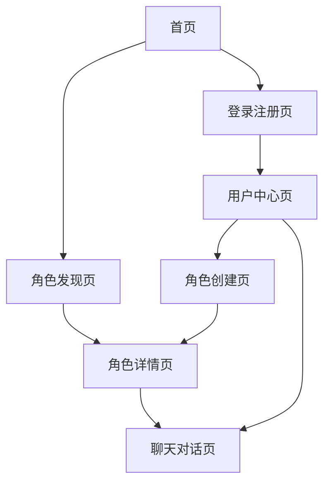

# AI角色扮演网站 - 产品需求文档

## 1. 产品概述

本项目旨在开发一个AI驱动的角色扮演网站，用户可以与预设角色进行对话，也可以创建和编辑自定义角色卡片。产品核心价值在于提供沉浸式的AI角色扮演体验，满足用户的娱乐和创作需求。

目标市场：AI聊天爱好者、角色扮演游戏玩家、内容创作者，预期通过优质的用户体验和丰富的角色库吸引用户。

## 2. 核心功能

### 2.1 用户角色

| 角色 | 注册方式 | 核心权限 |
|------|----------|----------|
| 普通用户 | 邮箱注册 | 浏览角色、与角色聊天、创建个人角色 |
| 创作者 | 普通用户升级 | 发布公开角色、查看角色统计数据 |

### 2.2 功能模块

我们的AI角色扮演网站包含以下主要页面：

1. **首页**：角色推荐展示、搜索入口、分类导航
2. **角色发现页**：角色列表、搜索筛选、分页浏览
3. **角色详情页**：角色信息展示、开始聊天入口
4. **聊天对话页**：实时对话界面、消息历史、会话配置
5. **角色创建页**：角色信息编辑、系统提示词配置
6. **用户中心页**：个人信息、我的角色、聊天记录
7. **登录注册页**：用户认证功能

### 2.3 页面详情

| 页面名称 | 模块名称 | 功能描述 |
|----------|----------|----------|
| 首页 | 推荐展示区 | 展示热门角色卡片，支持轮播切换 |
| 首页 | 搜索导航 | 提供角色搜索入口和分类导航 |
| 角色发现页 | 搜索筛选 | 关键词搜索、标签筛选、排序选择 |
| 角色发现页 | 角色列表 | 分页展示角色卡片，显示基本信息 |
| 角色详情页 | 角色信息 | 展示头像、名称、简介、作者信息 |
| 角色详情页 | 聊天入口 | 一键开始聊天按钮 |
| 聊天对话页 | 消息界面 | 流式文本输出、消息历史展示 |
| 聊天对话页 | 输入控制 | 文本输入框、发送按钮、会话配置 |
| 聊天对话页 | 会话管理 | 多轮对话记忆、摘要生成、上下文控制 |
| 角色创建页 | 基础信息 | 角色名称、简介、头像上传 |
| 角色创建页 | 系统配置 | System Prompt编辑、开场白设置 |
| 角色创建页 | 高级设置 | 生成参数、风格预设配置 |
| 用户中心页 | 个人信息 | 用户资料展示和编辑 |
| 用户中心页 | 我的角色 | 创建的角色列表管理 |
| 用户中心页 | 聊天记录 | 历史会话列表和管理 |
| 登录注册页 | 用户认证 | 邮箱登录注册、密码重置 |

## 3. 核心流程

**普通用户流程：**
用户访问首页 → 浏览推荐角色或搜索角色 → 查看角色详情 → 开始聊天对话 → 配置会话参数 → 进行多轮对话

**创作者流程：**
用户登录 → 进入角色创建页 → 填写角色基础信息 → 配置系统提示词 → 设置开场白和参数 → 保存发布 → 立即测试对话

## 4. 用户界面设计

### 4.1 设计风格

- **主色调**：深蓝色(#1a1a2e)和紫色(#16213e)渐变背景，营造科技感
- **辅助色**：亮蓝色(#0f4c75)用于按钮和链接，白色(#ffffff)用于文本
- **按钮样式**：圆角矩形按钮，支持悬停动画效果
- **字体**：中文使用思源黑体，英文使用Roboto，主要字号16px
- **布局风格**：卡片式布局，顶部导航栏固定
- **图标风格**：使用线性图标，支持动画效果

### 4.2 页面设计概览

| 页面名称 | 模块名称 | UI元素 |
|----------|----------|--------|
| 首页 | 推荐展示区 | 大尺寸角色卡片，渐变背景，轮播动画 |
| 首页 | 搜索导航 | 居中搜索框，分类标签，响应式布局 |
| 角色发现页 | 搜索筛选 | 顶部筛选栏，下拉选择器，标签按钮 |
| 角色发现页 | 角色列表 | 网格布局，卡片阴影效果，分页组件 |
| 角色详情页 | 角色信息 | 左右分栏布局，大头像展示，信息卡片 |
| 聊天对话页 | 消息界面 | 聊天气泡样式，流式文本动画，滚动优化 |
| 聊天对话页 | 输入控制 | 底部固定输入框，发送按钮，设置面板 |
| 角色创建页 | 表单界面 | 分步骤表单，实时预览，保存提示 |

### 4.3 响应式设计

采用移动端优先的响应式设计，支持桌面端和移动端自适应。在移动端优化触摸交互体验，聊天界面支持手势操作。