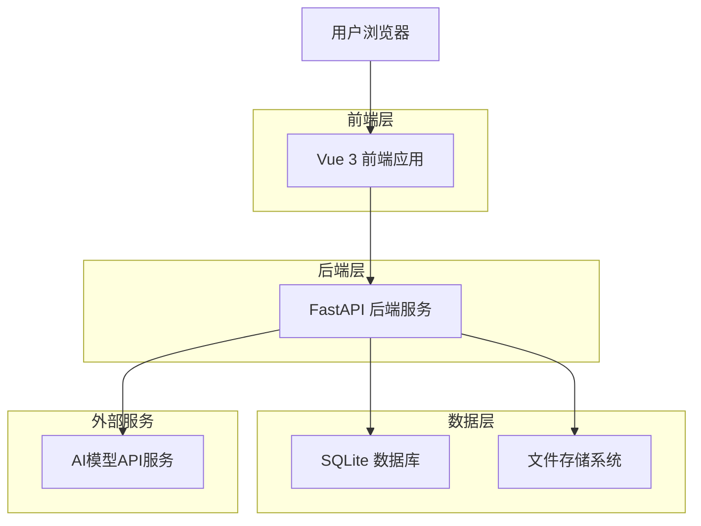
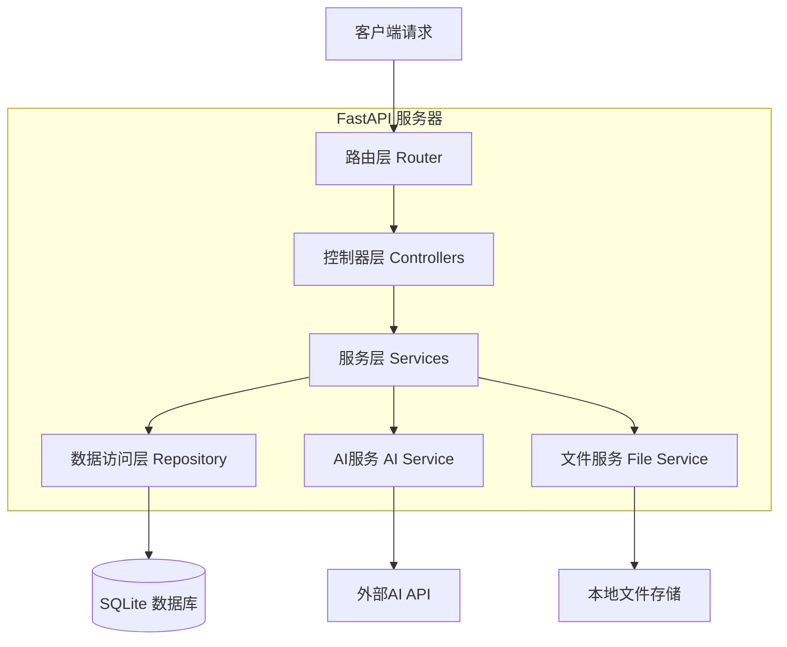
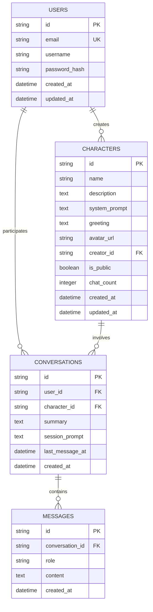

# AI角色扮演网站 - 技术架构文档

## 1. 架构设计



## 2. 技术描述

- **前端**: Vue 3 + Vite + Vue Router + Pinia + TailwindCSS
- **后端**: FastAPI + SQLAlchemy + Pydantic + asyncio
- **数据库**: SQLite (启用WAL模式)
- **AI服务**: OpenAI API / 其他LLM API

## 3. 路由定义

| 路由 | 用途 |
|------|------|
| / | 首页，展示推荐角色和导航 |
| /discover | 角色发现页，角色列表和搜索 |
| /character/:id | 角色详情页，显示角色信息 |
| /chat/:characterId | 聊天对话页，与角色进行对话 |
| /create | 角色创建页，创建和编辑角色 |
| /profile | 用户中心页，个人信息和管理 |
| /login | 登录页面 |
| /register | 注册页面 |

## 4. API定义

### 4.1 核心API

**用户认证相关**
```
POST /api/auth/register
```

请求参数:
| 参数名 | 参数类型 | 是否必需 | 描述 |
|--------|----------|----------|------|
| email | string | true | 用户邮箱 |
| password | string | true | 用户密码 |
| username | string | true | 用户名 |

响应:
| 参数名 | 参数类型 | 描述 |
|--------|----------|------|
| success | boolean | 注册是否成功 |
| message | string | 响应消息 |
| user_id | string | 用户ID |

```
POST /api/auth/login
```

请求参数:
| 参数名 | 参数类型 | 是否必需 | 描述 |
|--------|----------|----------|------|
| email | string | true | 用户邮箱 |
| password | string | true | 用户密码 |

响应:
| 参数名 | 参数类型 | 描述 |
|--------|----------|------|
| success | boolean | 登录是否成功 |
| access_token | string | 访问令牌 |
| user_info | object | 用户信息 |

**角色管理相关**
```
GET /api/characters
```

请求参数:
| 参数名 | 参数类型 | 是否必需 | 描述 |
|--------|----------|----------|------|
| page | integer | false | 页码，默认1 |
| limit | integer | false | 每页数量，默认20 |
| search | string | false | 搜索关键词 |
| sort | string | false | 排序方式：latest/popular |

响应:
| 参数名 | 参数类型 | 描述 |
|--------|----------|------|
| characters | array | 角色列表 |
| total | integer | 总数量 |
| page | integer | 当前页码 |

```
POST /api/characters
```

请求参数:
| 参数名 | 参数类型 | 是否必需 | 描述 |
|--------|----------|----------|------|
| name | string | true | 角色名称 |
| description | string | true | 角色简介 |
| system_prompt | string | true | 系统提示词 |
| greeting | string | true | 开场白 |
| avatar_url | string | false | 头像URL |

**聊天对话相关**
```
POST /api/chat/send
```

请求参数:
| 参数名 | 参数类型 | 是否必需 | 描述 |
|--------|----------|----------|------|
| character_id | string | true | 角色ID |
| message | string | true | 用户消息 |
| conversation_id | string | false | 会话ID |
| session_prompt | string | false | 会话级提示词 |

响应: 流式响应 (Server-Sent Events)
| 参数名 | 参数类型 | 描述 |
|--------|----------|------|
| type | string | 消息类型：token/complete |
| content | string | 消息内容 |
| conversation_id | string | 会话ID |

```
GET /api/conversations
```

请求参数:
| 参数名 | 参数类型 | 是否必需 | 描述 |
|--------|----------|----------|------|
| page | integer | false | 页码 |
| limit | integer | false | 每页数量 |

响应:
| 参数名 | 参数类型 | 描述 |
|--------|----------|------|
| conversations | array | 会话列表 |
| total | integer | 总数量 |

## 5. 服务器架构图



## 6. 数据模型

### 6.1 数据模型定义



### 6.2 数据定义语言

**用户表 (users)**
```sql
-- 创建用户表
CREATE TABLE users (
    id TEXT PRIMARY KEY DEFAULT (lower(hex(randomblob(16)))),
    email TEXT UNIQUE NOT NULL,
    username TEXT NOT NULL,
    password_hash TEXT NOT NULL,
    created_at DATETIME DEFAULT CURRENT_TIMESTAMP,
    updated_at DATETIME DEFAULT CURRENT_TIMESTAMP
);

-- 创建索引
CREATE INDEX idx_users_email ON users(email);
CREATE INDEX idx_users_created_at ON users(created_at DESC);
```

**角色表 (characters)**
```sql
-- 创建角色表
CREATE TABLE characters (
    id TEXT PRIMARY KEY DEFAULT (lower(hex(randomblob(16)))),
    name TEXT NOT NULL,
    description TEXT NOT NULL,
    system_prompt TEXT NOT NULL,
    greeting TEXT NOT NULL,
    avatar_url TEXT,
    creator_id TEXT NOT NULL,
    is_public BOOLEAN DEFAULT TRUE,
    chat_count INTEGER DEFAULT 0,
    created_at DATETIME DEFAULT CURRENT_TIMESTAMP,
    updated_at DATETIME DEFAULT CURRENT_TIMESTAMP,
    FOREIGN KEY (creator_id) REFERENCES users(id)
);

-- 创建索引
CREATE INDEX idx_characters_creator_id ON characters(creator_id);
CREATE INDEX idx_characters_is_public ON characters(is_public);
CREATE INDEX idx_characters_chat_count ON characters(chat_count DESC);
CREATE INDEX idx_characters_created_at ON characters(created_at DESC);
CREATE INDEX idx_characters_name ON characters(name);
```

**会话表 (conversations)**
```sql
-- 创建会话表
CREATE TABLE conversations (
    id TEXT PRIMARY KEY DEFAULT (lower(hex(randomblob(16)))),
    user_id TEXT NOT NULL,
    character_id TEXT NOT NULL,
    summary TEXT,
    session_prompt TEXT,
    last_message_at DATETIME DEFAULT CURRENT_TIMESTAMP,
    created_at DATETIME DEFAULT CURRENT_TIMESTAMP,
    FOREIGN KEY (user_id) REFERENCES users(id),
    FOREIGN KEY (character_id) REFERENCES characters(id)
);

-- 创建索引
CREATE INDEX idx_conversations_user_id ON conversations(user_id);
CREATE INDEX idx_conversations_character_id ON conversations(character_id);
CREATE INDEX idx_conversations_last_message_at ON conversations(last_message_at DESC);
```

**消息表 (messages)**
```sql
-- 创建消息表
CREATE TABLE messages (
    id TEXT PRIMARY KEY DEFAULT (lower(hex(randomblob(16)))),
    conversation_id TEXT NOT NULL,
    role TEXT NOT NULL CHECK (role IN ('user', 'assistant', 'system')),
    content TEXT NOT NULL,
    created_at DATETIME DEFAULT CURRENT_TIMESTAMP,
    FOREIGN KEY (conversation_id) REFERENCES conversations(id)
);

-- 创建索引
CREATE INDEX idx_messages_conversation_id ON messages(conversation_id);
CREATE INDEX idx_messages_created_at ON messages(created_at DESC);
```

**启用WAL模式**
```sql
-- 启用WAL模式提升并发性能
PRAGMA journal_mode=WAL;
PRAGMA synchronous=NORMAL;
PRAGMA cache_size=10000;
PRAGMA temp_store=memory;
```

**初始化数据**
```sql
-- 插入示例角色
INSERT INTO characters (name, description, system_prompt, greeting, creator_id, is_public)
VALUES 
('AI助手', '友善的AI助手，可以回答各种问题', '你是一个友善、有帮助的AI助手。请用简洁明了的语言回答用户的问题。', '你好！我是AI助手，有什么可以帮助你的吗？', 'system', TRUE),
('小说家', '擅长创作故事的作家角色', '你是一位富有想象力的小说家，擅长创作各种类型的故事。请用生动的语言和丰富的细节来回应。', '欢迎来到我的创作世界！让我们一起编织一个精彩的故事吧。', 'system', TRUE);
```