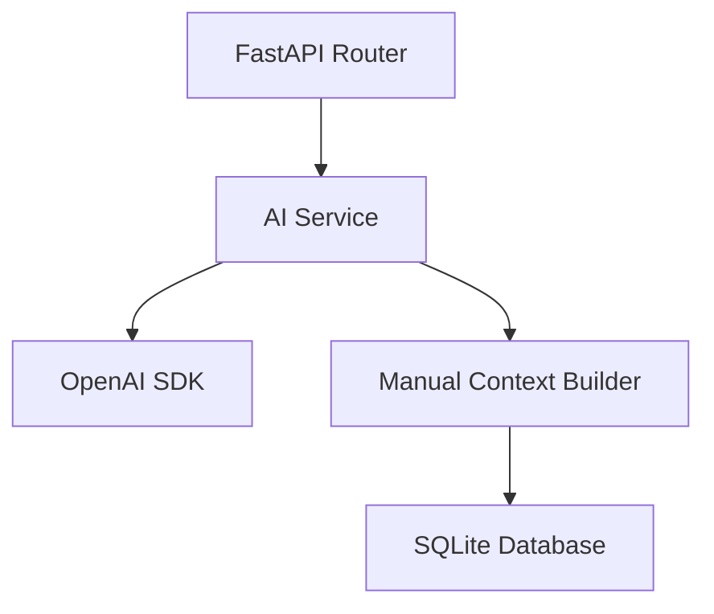
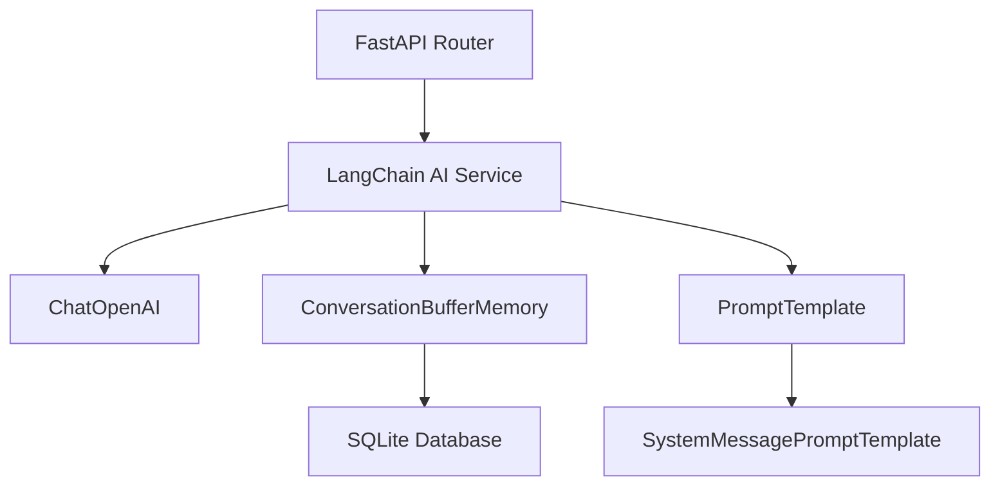

# LangChain迁移技术文档

## 1. 当前架构分析

### 1.1 现有技术栈
- **AI服务**: 原生OpenAI SDK (openai==1.51.0)
- **后端框架**: FastAPI
- **数据库**: SQLAlchemy + SQLite
- **异步处理**: 原生asyncio
- **核心文件**: ai_service.py (149行), routers/messages.py (298行)

### 1.2 当前功能特性
- ✅ 流式响应处理
- ✅ 对话上下文管理
- ✅ 消息历史处理
- ✅ 会话摘要生成
- ✅ 角色系统提示词
- ✅ 多提供商支持 (OpenAI/OpenRouter)

### 1.3 架构优势
- 轻量级，依赖少
- 直接控制API调用参数
- 自定义对话上下文管理
- 代码结构清晰

### 1.4 现有局限性
- 手动管理对话记忆
- 缺乏高级提示词模板
- 上下文窗口管理较简单
- 缺少工具调用能力
- 没有RAG支持

## 2. LangChain迁移方案设计

### 2.1 迁移目标
- 保持现有功能完整性
- 增强对话记忆管理
- 提升提示词处理能力
- 为未来扩展做准备
- 保持API接口不变

### 2.2 技术架构升级

#### 升级前架构


#### 升级后架构


### 2.3 核心组件映射

| 现有组件 | LangChain组件 | 功能增强 |
|---------|---------------|----------|
| AsyncOpenAI | ChatOpenAI | 更好的配置管理 |
| 手动上下文构建 | ConversationBufferMemory | 智能记忆管理 |
| 字符串拼接提示词 | PromptTemplate | 模板化提示词 |
| 简单流式响应 | StreamingStdOutCallbackHandler | 更丰富的回调 |
| 手动摘要生成 | SummarizationChain | 专业摘要链 |

## 3. 具体实施步骤

### 3.1 阶段一：环境准备 (30分钟)

#### 3.1.1 依赖更新
```bash
# 添加到 requirements.txt
langchain==0.1.0
langchain-openai==0.0.5
langchain-community==0.0.10
```

#### 3.1.2 安装依赖
```bash
cd api
pip install langchain langchain-openai langchain-community
```

### 3.2 阶段二：核心服务重构 (2-3小时)

#### 3.2.1 创建新的LangChain服务
创建 `langchain_service.py`，包含：
- ChatOpenAI客户端初始化
- ConversationBufferMemory配置
- PromptTemplate定义
- 流式响应处理

#### 3.2.2 保留原服务作为备份
重命名 `ai_service.py` 为 `ai_service_backup.py`

### 3.3 阶段三：API路由适配 (1-2小时)

#### 3.3.1 修改消息路由
更新 `routers/messages.py` 中的AI服务调用

#### 3.3.2 保持接口兼容
确保API响应格式不变

### 3.4 阶段四：测试验证 (1小时)

#### 3.4.1 功能测试
- 基础对话功能
- 流式响应
- 会话记忆
- 角色扮演

#### 3.4.2 性能测试
- 响应时间对比
- 内存使用情况
- 并发处理能力

## 4. 代码改造计划

### 4.1 新建 langchain_service.py

```python
from langchain_openai import ChatOpenAI
from langchain.memory import ConversationBufferMemory
from langchain.prompts import (
    ChatPromptTemplate,
    SystemMessagePromptTemplate,
    HumanMessagePromptTemplate,
    MessagesPlaceholder
)
from langchain.schema import BaseMessage
from langchain.callbacks.streaming_stdout import StreamingStdOutCallbackHandler
from typing import List, Dict, AsyncGenerator, Optional
import asyncio
from config import settings

class LangChainAIService:
    def __init__(self):
        self.llm = None
        self.memory_store = {}  # 存储每个会话的记忆
        self._init_llm()
    
    def _init_llm(self):
        """初始化LangChain LLM"""
        if settings.ai_service_provider == "openrouter":
            self.llm = ChatOpenAI(
                api_key=settings.openrouter_api_key,
                base_url="https://openrouter.ai/api/v1",
                model=settings.default_ai_model,
                temperature=0.7,
                streaming=True
            )
        elif settings.ai_service_provider == "openai":
            self.llm = ChatOpenAI(
                api_key=settings.openai_api_key,
                model=settings.default_ai_model,
                temperature=0.7,
                streaming=True
            )
    
    def get_memory(self, conversation_id: str) -> ConversationBufferMemory:
        """获取或创建会话记忆"""
        if conversation_id not in self.memory_store:
            self.memory_store[conversation_id] = ConversationBufferMemory(
                return_messages=True,
                memory_key="chat_history"
            )
        return self.memory_store[conversation_id]
    
    def create_prompt_template(self, system_prompt: str) -> ChatPromptTemplate:
        """创建提示词模板"""
        return ChatPromptTemplate.from_messages([
            SystemMessagePromptTemplate.from_template(system_prompt),
            MessagesPlaceholder(variable_name="chat_history"),
            HumanMessagePromptTemplate.from_template("{input}")
        ])
    
    async def generate_response(
        self,
        conversation_id: str,
        user_input: str,
        system_prompt: str,
        **kwargs
    ) -> AsyncGenerator[str, None]:
        """生成流式响应"""
        if not self.llm:
            yield "AI服务暂不可用，请稍后重试。"
            return
        
        try:
            memory = self.get_memory(conversation_id)
            prompt_template = self.create_prompt_template(system_prompt)
            
            # 构建完整提示词
            messages = prompt_template.format_messages(
                input=user_input,
                chat_history=memory.chat_memory.messages
            )
            
            # 流式生成响应
            response = ""
            async for chunk in self.llm.astream(messages):
                if chunk.content:
                    response += chunk.content
                    yield chunk.content
            
            # 更新记忆
            memory.chat_memory.add_user_message(user_input)
            memory.chat_memory.add_ai_message(response)
            
        except Exception as e:
            yield f"抱歉，AI服务出现错误：{str(e)}"
    
    async def generate_summary(
        self,
        conversation_id: str,
        max_length: int = 100
    ) -> str:
        """生成会话摘要"""
        if not self.llm:
            return "会话摘要"
        
        try:
            memory = self.get_memory(conversation_id)
            messages = memory.chat_memory.messages
            
            if not messages:
                return "会话摘要"
            
            # 使用LangChain的摘要功能
            from langchain.chains.summarize import load_summarize_chain
            from langchain.docstore.document import Document
            
            # 将消息转换为文档
            text = "\n".join([f"{msg.type}: {msg.content}" for msg in messages[-10:]])
            docs = [Document(page_content=text)]
            
            # 生成摘要
            chain = load_summarize_chain(self.llm, chain_type="stuff")
            summary = await chain.arun(docs)
            
            return summary[:max_length] if summary else "会话摘要"
            
        except Exception as e:
            return "会话摘要"

# 全局服务实例
langchain_ai_service = LangChainAIService()
```

### 4.2 修改 routers/messages.py

主要修改点：
1. 导入新的LangChain服务
2. 更新AI响应生成逻辑
3. 简化上下文构建过程

```python
# 替换导入
from langchain_service import langchain_ai_service

# 修改发送消息的AI响应部分
async def generate_response():
    full_response = ""
    
    # 发送初始消息信息
    yield f"data: {json.dumps({'type': 'message_start', 'message_id': ai_message_id})}\n\n"
    
    try:
        # 使用LangChain服务生成响应
        async for chunk in langchain_ai_service.generate_response(
            conversation_id=conversation_id,
            user_input=message_data.content,
            system_prompt=conversation.character.system_prompt
        ):
            full_response += chunk
            yield f"data: {json.dumps({'type': 'content', 'content': chunk})}\n\n"
        
        # 更新数据库
        ai_message.content = full_response
        conversation.last_message_at = datetime.utcnow()
        db.commit()
        
        yield f"data: {json.dumps({'type': 'message_end', 'message_id': ai_message_id})}\n\n"
        
    except Exception as e:
        error_msg = "抱歉，AI服务出现错误，请稍后重试。"
        ai_message.content = error_msg
        db.commit()
        yield f"data: {json.dumps({'type': 'error', 'message': error_msg})}\n\n"
    
    yield "data: [DONE]\n\n"
```

### 4.3 配置文件更新

在 `config.py` 中添加LangChain相关配置：

```python
# LangChain配置
LANGCHAIN_TRACING_V2: bool = False
LANGCHAIN_API_KEY: Optional[str] = None
LANGCHAIN_PROJECT: str = "ai-roleplay"
```

## 5. 测试验证方案

### 5.1 单元测试

创建 `test_langchain_service.py`：

```python
import pytest
import asyncio
from langchain_service import LangChainAIService

@pytest.fixture
def ai_service():
    return LangChainAIService()

@pytest.mark.asyncio
async def test_generate_response(ai_service):
    """测试响应生成"""
    response_chunks = []
    async for chunk in ai_service.generate_response(
        conversation_id="test_conv",
        user_input="你好",
        system_prompt="你是一个友好的助手"
    ):
        response_chunks.append(chunk)
    
    assert len(response_chunks) > 0
    full_response = "".join(response_chunks)
    assert len(full_response) > 0

@pytest.mark.asyncio
async def test_memory_persistence(ai_service):
    """测试记忆持久化"""
    conv_id = "test_memory"
    
    # 第一轮对话
    async for _ in ai_service.generate_response(
        conversation_id=conv_id,
        user_input="我叫张三",
        system_prompt="记住用户的信息"
    ):
        pass
    
    # 第二轮对话
    response_chunks = []
    async for chunk in ai_service.generate_response(
        conversation_id=conv_id,
        user_input="我叫什么名字？",
        system_prompt="记住用户的信息"
    ):
        response_chunks.append(chunk)
    
    full_response = "".join(response_chunks)
    assert "张三" in full_response
```

### 5.2 集成测试

```python
import requests
import json

def test_chat_api_compatibility():
    """测试聊天API兼容性"""
    # 创建会话
    response = requests.post("http://localhost:8000/api/conversations", json={
        "character_id": "sarah_moon"
    })
    assert response.status_code == 200
    conv_data = response.json()
    
    # 发送消息
    response = requests.post(
        f"http://localhost:8000/api/conversations/{conv_data['id']}/messages",
        json={"content": "你好"}
    )
    assert response.status_code == 200
    
    # 验证流式响应
    assert response.headers.get("content-type") == "text/event-stream"
```

### 5.3 性能测试

```python
import time
import asyncio
from langchain_service import langchain_ai_service

async def benchmark_response_time():
    """基准测试响应时间"""
    start_time = time.time()
    
    response_chunks = []
    async for chunk in langchain_ai_service.generate_response(
        conversation_id="benchmark",
        user_input="请介绍一下你自己",
        system_prompt="你是一个AI助手"
    ):
        response_chunks.append(chunk)
    
    end_time = time.time()
    total_time = end_time - start_time
    total_tokens = len("".join(response_chunks))
    
    print(f"总响应时间: {total_time:.2f}秒")
    print(f"总token数: {total_tokens}")
    print(f"平均速度: {total_tokens/total_time:.2f} tokens/秒")

if __name__ == "__main__":
    asyncio.run(benchmark_response_time())
```

## 6. 迁移风险评估

### 6.1 技术风险
- **低风险**: API接口保持不变
- **中风险**: 依赖包增加，可能存在版本冲突
- **低风险**: LangChain相对成熟稳定

### 6.2 功能风险
- **低风险**: 核心功能保持一致
- **中风险**: 记忆管理逻辑变化
- **低风险**: 流式响应机制相似

### 6.3 性能风险
- **中风险**: 初始化开销可能增加
- **低风险**: 运行时性能预期相当
- **中风险**: 内存使用可能增加

## 7. 回滚方案

### 7.1 快速回滚
1. 恢复 `ai_service_backup.py` 为 `ai_service.py`
2. 还原 `routers/messages.py` 的修改
3. 重启服务

### 7.2 渐进式迁移
1. 保留两套服务并存
2. 通过配置开关控制使用哪套服务
3. 逐步验证后完全切换

## 8. 后续扩展规划

### 8.1 短期扩展 (1-2周)
- 添加更多记忆类型 (ConversationSummaryMemory)
- 实现提示词模板管理
- 添加对话链 (ConversationChain)

### 8.2 中期扩展 (1-2月)
- 集成向量数据库支持RAG
- 添加工具调用能力 (Tools/Agents)
- 实现多轮复杂推理

### 8.3 长期扩展 (3-6月)
- 构建知识图谱
- 实现多模态对话
- 添加自定义Chain开发能力

## 9. 总结

本迁移方案设计为**渐进式、低风险**的升级路径，预计总工作量为 **1-2个工作日**。通过引入LangChain，项目将获得更强大的对话管理能力，为未来的AI功能扩展奠定坚实基础。

**关键成功因素：**
- 保持API接口兼容性
- 充分的测试验证
- 完善的回滚机制
- 分阶段实施策略